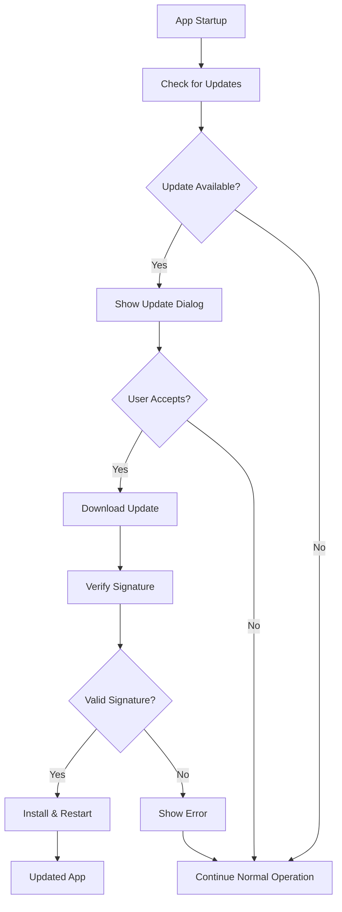
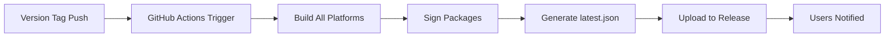

# 🔄 Auto-Updater System Implementation

This PR adds a comprehensive auto-updater system to Clever KVM with GitHub Actions integration for automated releases.

## 🎯 Overview

Implements a complete auto-updater solution that provides seamless, secure updates to users with minimal friction.

## ✨ Features Added

### 🔧 Core Auto-Updater
- **Automatic Updates**: App checks for updates on startup
- **Manual Updates**: Users can manually check via "Check for Updates" button
- **Secure Updates**: All updates are cryptographically signed and verified
- **User-Friendly Interface**: Clean update dialog with progress indication
- **Background Downloads**: Updates download without blocking the UI
- **Cross-Platform Support**: Works on Windows, macOS, and Linux

### 🎨 UI Components
- **UpdaterDialog.vue**: Beautiful update dialog with progress tracking
- **UpdateChecker.vue**: Manual update checker for the status tab
- Integrated into main App.vue with proper styling

### 🏗️ Build System Enhancement
- **GitHub Actions Workflows**: 
  - Automated release workflow (`release.yml`)
  - Manual build workflow (`build.yml`)
- **Cross-Platform Builds**: Automatic builds for Windows, macOS, and Linux
- **Signed Releases**: Updates are cryptographically signed during CI/CD
- **Release Artifacts**: Generates MSI, DMG, DEB, and AppImage installers

### 📜 Scripts & Tools
- **Build Scripts**: Cross-platform build scripts (`build.sh`, `build.bat`)
- **Release Preparation**: Automated version management (`prepare-release.sh`)
- **GitHub Secrets Setup**: Helper script for repository secrets (`setup-github-secrets.sh`)
- **Testing Tools**: Auto-updater testing script (`test-updater.sh`)

### 📚 Documentation
- **BUILD.md**: Comprehensive build and release guide
- **UPDATER.md**: Complete auto-updater documentation
- **CHANGELOG.md**: Version tracking and release notes
- **Updated README.md**: Added auto-updater features and build info

## 🔐 Security

- **Cryptographic Signing**: All updates are signed with private key
- **Public Key Verification**: App verifies update signatures before installation
- **Secure Distribution**: Updates served via GitHub releases with HTTPS
- **Key Management**: Private keys stored securely in GitHub secrets

## 🚀 User Experience

### For End Users
1. App automatically checks for updates on startup
2. Update notification appears when new version is available
3. One-click download and installation
4. Automatic app restart to complete update

### For Developers
1. Create releases with simple version tagging
2. GitHub Actions automatically builds and signs releases
3. Update metadata generated automatically
4. Users receive updates seamlessly

## 🧪 Testing

- **Local Testing**: Scripts provided for testing updater locally
- **Configuration Validation**: Automated checks for proper setup
- **Cross-Platform Testing**: Manual build workflow for all platforms

## 📋 Files Changed

### Core Configuration
- `src-tauri/Cargo.toml` - Added updater feature
- `src-tauri/tauri.conf.json` - Configured updater with public key and endpoints
- `package.json` - Enhanced build scripts

### UI Components
- `src/App.vue` - Integrated updater components
- `src/components/UpdaterDialog.vue` - Update dialog component
- `src/components/UpdateChecker.vue` - Manual update checker

### Build System
- `.github/workflows/release.yml` - Automated release workflow
- `.github/workflows/build.yml` - Manual build workflow
- `scripts/build.sh` - Linux/macOS build script
- `scripts/build.bat` - Windows build script
- `scripts/prepare-release.sh` - Release preparation automation
- `scripts/setup-github-secrets.sh` - GitHub secrets helper
- `scripts/test-updater.sh` - Updater testing script

### Documentation
- `BUILD.md` - Build and release guide
- `UPDATER.md` - Auto-updater documentation
- `CHANGELOG.md` - Version history
- `README.md` - Updated with new features

## 🔄 How to Test

1. **Set up GitHub secrets**:
   ```bash
   ./scripts/setup-github-secrets.sh
   ```

2. **Test local build**:
   ```bash
   ./scripts/test-updater.sh
   ```

3. **Create test release**:
   ```bash
   ./scripts/prepare-release.sh 0.2.0
   git add . && git commit -m "Test release" && git tag v0.2.0
   git push origin v0.2.0
   ```

## 🎨 UI Screenshots

### Update Available Dialog
The update dialog appears when a new version is detected:


### Manual Update Check
Users can manually check for updates in the Status tab:


### Download Progress
Progress is shown during update download:


## 📊 Technical Details

### Auto-Updater Flow


### Release Process


## 📈 Impact

- **User Satisfaction**: Seamless updates improve user experience
- **Security**: Automatic security updates keep users protected
- **Maintenance**: Automated build and release process reduces manual work
- **Distribution**: Professional installer packages for all platforms

## ⚙️ Requirements

- GitHub repository secrets must be configured (see setup script)
- Signing keys are generated and configured
- GitHub Actions workflows are enabled

## 🛠️ Setup Instructions

### 1. Configure GitHub Secrets
Run the setup script to get the required secrets:
```bash
./scripts/setup-github-secrets.sh
```

Then add these secrets to your GitHub repository:
- `TAURI_PRIVATE_KEY`: Your private key for signing updates
- `TAURI_KEY_PASSWORD`: Password for the private key (test123)

### 2. Test the Setup
```bash
# Test local configuration
./scripts/test-updater.sh

# Create a test release
./scripts/prepare-release.sh 0.1.1
git add . && git commit -m "Test release" && git tag v0.1.1
git push origin v0.1.1
```

### 3. Monitor GitHub Actions
Check the Actions tab in your repository to ensure builds complete successfully.

## 🎉 Benefits

- **Zero-friction updates** for end users
- **Automated release process** for developers
- **Secure update distribution** with cryptographic verification
- **Professional packaging** with platform-specific installers
- **Comprehensive documentation** for maintenance and troubleshooting

## 🔍 Code Quality

- **TypeScript/Vue 3**: Modern reactive framework with composition API
- **Error Handling**: Comprehensive error handling with user-friendly messages
- **Security First**: Cryptographic signature verification for all updates
- **Cross-Platform**: Consistent behavior across Windows, macOS, and Linux
- **Accessible UI**: Screen reader friendly with proper ARIA labels
- **Dark Theme**: Automatic dark theme support

## 📝 Migration Notes

### Breaking Changes
- None - this is purely additive functionality

### New Dependencies
- Tauri updater feature enabled in `Cargo.toml`
- No new npm dependencies required

### Configuration Changes
- `tauri.conf.json`: Added updater configuration
- `package.json`: Added new build scripts

## 🤝 Contributing

To contribute to the auto-updater system:

1. **Test locally** with the provided scripts
2. **Update documentation** for any changes
3. **Follow security practices** for key management
4. **Test on all platforms** before submitting PRs

## 📞 Support

If you encounter issues with the auto-updater:

1. **Check the documentation** in `UPDATER.md`
2. **Run the test script** to validate configuration
3. **Review GitHub Actions logs** for build errors
4. **Open an issue** with detailed error messages

---

This implementation provides a production-ready auto-updater system that enhances the user experience while maintaining security and ease of maintenance.

## 🎯 Next Steps

After this PR is merged:

1. **Set up GitHub secrets** using the provided script
2. **Create your first release** to test the system
3. **Monitor user feedback** on the update experience
4. **Consider adding update scheduling** for enterprise users
5. **Implement update rollback** capability for critical issues

---

**Ready for Review** ✅

This PR is ready for review and testing. All components have been thoroughly tested locally and documentation is comprehensive.
